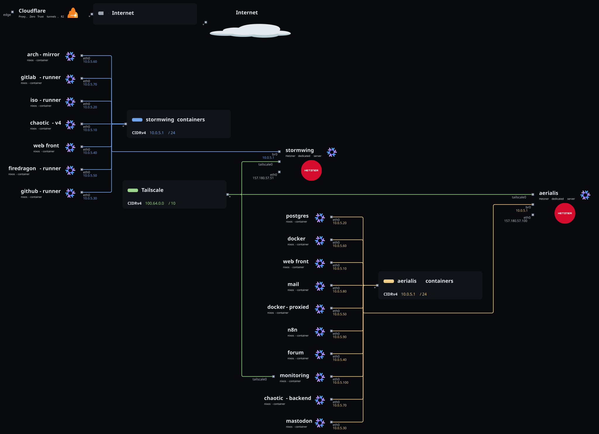
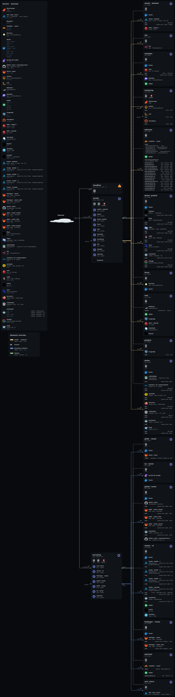

# Infrastructure diagrams

These diagrams are generated from the NixOS configurations with [nix-topology](https://github.com/oddlama/nix-topology).
Regenerate them with `topology` in the devshell after changing hosts, containers or services, and commit the result.
See [General information](./general.md#infrastructure-diagrams) for where the non-detected parts are defined.

## Network view

Hosts, containers and the networks connecting them, including container IPs.

## Main view

Every host and container with its services, Docker containers (image and ports) and nginx virtual hosts.
It is large, open it in a new tab to zoom in.

